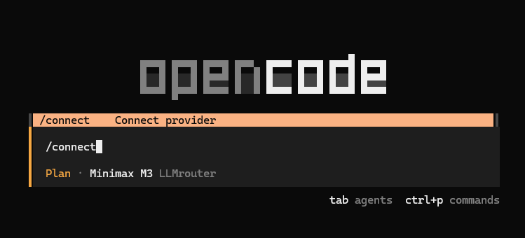
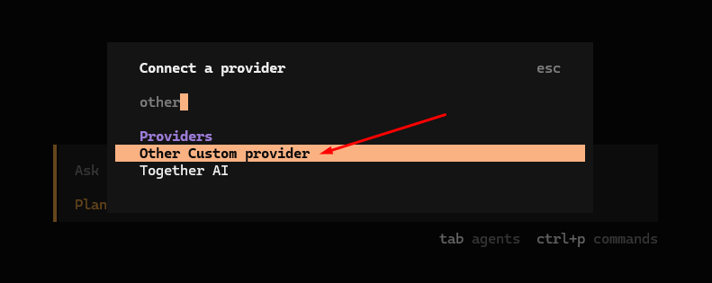
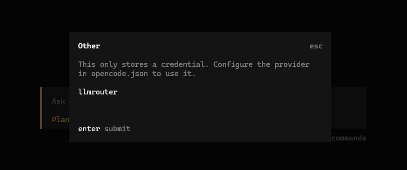
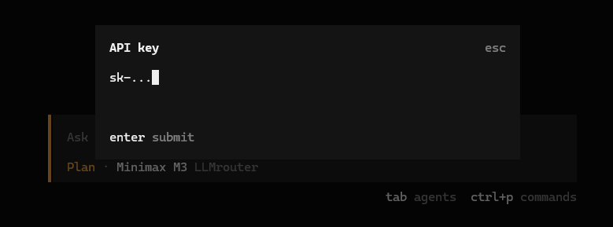

<div align="center">

<div style="display: flex; flex-direction: row; align-items: center; justify-content: center; gap: 3em; margin-bottom: 2em">

<div>
X
</div>

</div>

# Opencode Plugin for LLMrouter.eu
Load the model list automatically including cost, token limits, and modalities.

</div>


## Setup

1. Open opencode and type `/connect`



2. Search for `other` and click on `Other Custom Provider`



3. Type `llmrouter` or `llmrouter-{something}` or `llmrouter_{something}` and press enter



4. Paste your LLMrouter.eu API-key and press enter



5. For a global setup of opencode go to `"C:\Users\{UserName}\.config\opencode\opencode.jsonc"` and add the following

```
{
  "$schema": "https://opencode.ai/config.json",
  "plugin": [
    "opencode-llmrouter@git+https://github.com/to-cl/opencode-llmrouter.git"
  ],
  "provider": {
    "llmrouter": {
      "npm": "@ai-sdk/openai-compatible",
      "name": "LLMrouter",
      "options": {
        "baseURL": "https://proxy.llmrouter.eu/v1",
        "modelUrl": "https://backend.llmrouter.eu/public/models",
        "includeUsage": true
      }
    }
  }
}
```